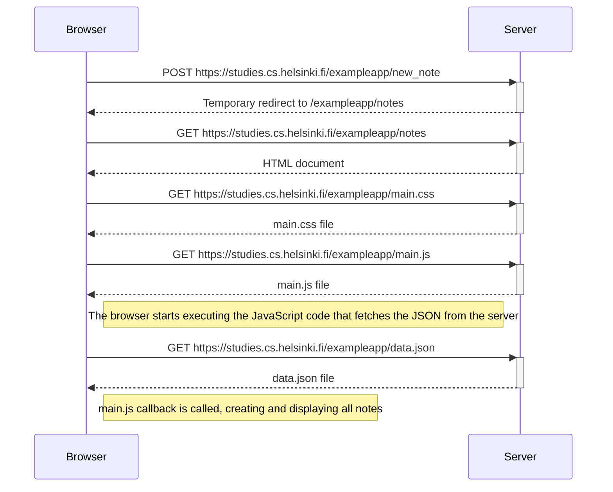

```mermaid
sequenceDiagram
    participant Browser
    participant Server

	Browser->>+Server: POST https://studies.cs.helsinki.fi/exampleapp/new_note
	Server-->>-Browser: Temporary redirect to /exampleapp/notes

	Browser->>+Server: GET https://studies.cs.helsinki.fi/exampleapp/notes
	Server-->>-Browser: HTML document

	Browser->>+Server: GET https://studies.cs.helsinki.fi/exampleapp/main.css
	Server-->>-Browser: main.css file

	Browser->>+Server: GET https://studies.cs.helsinki.fi/exampleapp/main.js
	Server-->>-Browser: main.js file

	Note right of Browser: The browser starts executing the JavaScript code that fetches the JSON from the server

	Browser->>+Server: GET https://studies.cs.helsinki.fi/exampleapp/data.json
	Server-->>-Browser: data.json file

	Note right of Browser: main.js callback is called, creating and displaying all notes
```
