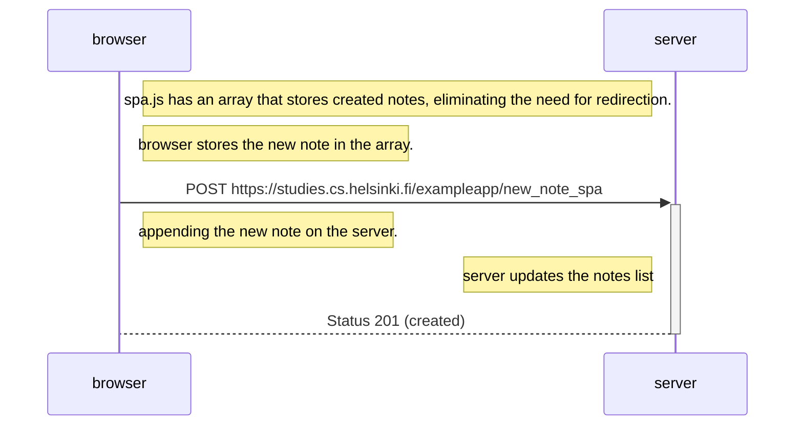

```mermaid
sequenceDiagram
    participant browser
    participant server

    Note right of browser: spa.js has an array that stores created notes, eliminating the need for redirection.
    Note right of browser: browser stores the new note in the array.

    browser->>+server: POST https://studies.cs.helsinki.fi/exampleapp/new_note_spa
    Note right of browser: appending the new note on the server.

    Note left of server: server updates the notes list
    server-->-browser: Status 201 (created)
```
